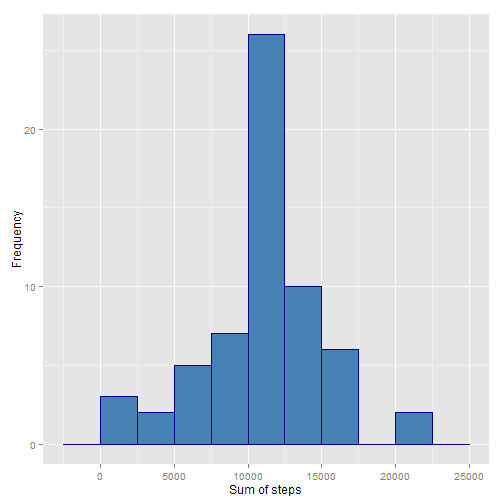

#Background information
It is now possible to collect a large amount of data about personal movement using activity monitoring devices such as a Fitbit, Nike Fuelband, or Jawbone Up. These type of devices are part of the “quantified self” movement – a group of enthusiasts who take measurements about themselves regularly to improve their health, to find patterns in their behavior, or because they are tech geeks. But these data remain under-utilized both because the raw data are hard to obtain and there is a lack of statistical methods and software for processing and interpreting the data.

This assignment makes use of data from a personal activity monitoring device. This device collects data at 5 minute intervals through out the day. The data consists of two months of data from an anonymous individual collected during the months of October and November, 2012 and include the number of steps taken in 5 minute intervals each day.

#Dataset
The data for this assignment can be downloaded from the course web site:
      
[Dataset: Activity monitoring data](https://d396qusza40orc.cloudfront.net/repdata%2Fdata%2Factivity.zip) [52K]

The variables included in this dataset are:
      
* steps: Number of steps taking in a 5-minute interval (missing values are coded as NA)

* date: The date on which the measurement was taken in YYYY-MM-DD format

* interval: Identifier for the 5-minute interval in which measurement was taken

The dataset is stored in a comma-separated-value (CSV) file and there are a total of 17,568 observations in this dataset.

#Analysis


###1. Loading and preprocessing the data


Load necessary libraries


```r
library(dplyr)
library(ggplot2)
library(lattice)
```


```
## [1] "English_United States.1252"
```


Download the data if not already downloaded and then load it:

```r
if(!file.exists("activity.csv")){
      
      download.file("https://d396qusza40orc.cloudfront.net/repdata%2Fdata%2Factivity.zip", 
                    destfile = "repdata-data-activity.zip")
      
      unzip("repdata-data-activity.zip")
}

activity_data <- read.csv("activity.csv")
```


Remove "NA" values:

```r
activity_data <- na.omit(activity_data)
```


###2. What is mean total number of steps taken per day?

Make a summary of sum of steps for each day:

```r
summary <- group_by(activity_data, date) %>% summarise(sum = sum(steps))
```

Finally, plot the data:

```r
g <- ggplot(summary, aes(sum))
g + geom_histogram(binwidth = 2500, 
                   color = "darkblue", 
                   fill = "steelblue") + 
      xlab("Sum of steps") + 
      ylab("Frequency")
```

 

Now, compute the mean...:

```r
floor(mean(summary$sum))
```

```
## [1] 10766
```

...and median of the data:

```r
median(summary$sum)
```

```
## [1] 10765
```


###3. What is the average daily activity pattern?

Compute the average number of steps taken averaged across all days:

```r
mean_steps <- aggregate(activity_data$steps, by = list(activity_data$interval), FUN = mean)
colnames(mean_steps) <- c("interval", "mean")
```

Plot the data:

```r
h <- ggplot(mean_steps, aes(interval, mean))
h + geom_line(col = "steelblue3") + xlab("Interval") + ylab("Mean number of steps per day")
```

 

Obtain the interval over which the highest mean number of steps occurred:

```r
mean_steps[which.max(mean_steps$mean),]
```

```
##     interval     mean
## 104      835 206.1698
```

###4. Imputing missing values

Imputing missing data is done by assigning to all NA values the mean of appropriate interval (as given by "mean_steps" variable).

Load the dataset once again so that it is raw, downloaded data and get the number of missing values:

```r
activity_data <- read.csv("activity.csv")
sum(is.na(activity_data))
```

```
## [1] 2304
```

Fill in the NAs with mean for each interval:

```r
for(i in 1:dim(activity_data)[1]){

if(is.na(activity_data[i, 1])){
current_interval <- activity_data[i,3]
interval_mean <- subset(mean_steps, interval == current_interval)[2]
interval_mean <- interval_mean$mean
activity_data[i,1] <- interval_mean
}
}
```

Make a summary of sum of steps for each day (NAs filled):

```r
summary_nona <- group_by(activity_data, date) %>% summarise(sum = sum(steps))
```

Finally, plot the data:

```r
i <- ggplot(summary_nona, aes(sum))
i + geom_histogram(binwidth = 2500, 
color = "darkblue", 
fill = "steelblue") + 
xlab("Sum of steps") + 
ylab("Frequency")
```

 

New mean:

```r
floor(mean(summary_nona$sum))
```

```
## [1] 10766
```

And median:

```r
median(summary_nona$sum)
```

```
## [1] 10766.19
```
Clearly, these values do not differ basically at all from the previous ones (10766 and 10765 accordingly). The impact is, in the case of our data, negligible.

###5. Are there differences in activity patterns between weekdays and weekends?

First, convert "data" column to "date" class:

```r
activity_data$date <- as.Date(activity_data$date)
```

Next, add column with labels indicating whether a given day is a weekday or weekend day:

```r
activity_data$weekday <- weekdays(activity_data$date)
for(i in 1:length(activity_data$date)){

if(activity_data$weekday[i] == "Saturday" | activity_data$weekday[i] == "Sunday"){
activity_data$weekday[i] <- "weekend"
}else{
activity_data$weekday[i] <- "weekday"
}
}
```

To make a panel plot, we first need to group data by interval and weekday:

```r
activity_weekday_summary <- group_by(activity_data, interval, weekday) %>% summarise(mean = mean(steps))
```

Now, we can make the plot itself:

```r
xyplot(data = activity_weekday_summary, mean ~ interval | weekday, 
       type = "l", 
       col = "steelblue2", 
       xlab = "Interval", 
       ylab = "Mean number of steps per day")
```

 
